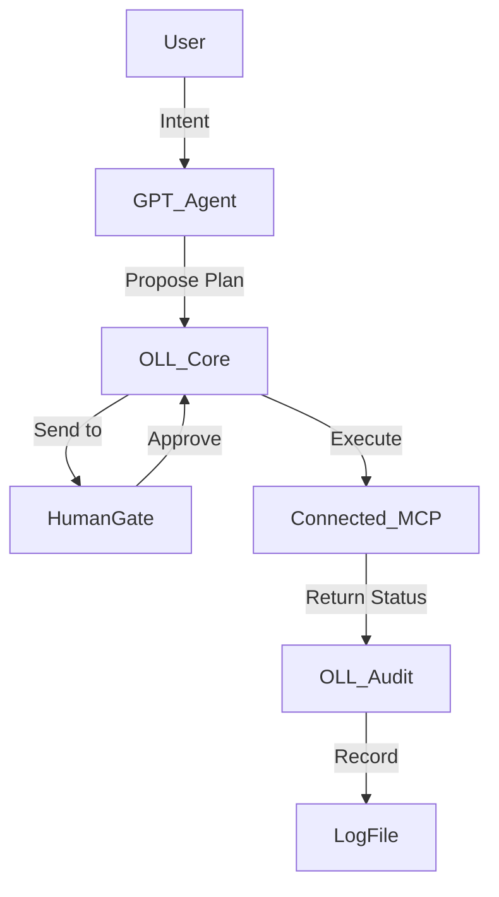

# AI-OS – Orchestration-Lite Layer (OLL)

**גרסה**: 0.1 (Draft)
**תאריך**: 24 נובמבר 2025
**סטטוס**: 🧠 טיוטה ראשונית

---

## 🎯 מטרת השכבה

ה-Orchestration-Lite Layer (OLL) נועדה להחליף את ה-MCP ההיסטורי במנגנון **קל, בטוח, מודולרי** לניהול תקשורת וזרימות בין סוכנים במערכת AI-OS.

### עקרונות מנחים
- **Human-in-the-loop** – כל פעולה משמעותית דורשת אישור אנושי.
- **Thin by Design** – לא מנוע כבד, אלא שכבת תיווך בלבד.
- **Transparent** – כל פעולה מתועדת בזמן אמת (Audit Log).
- **Composable** – כל סוכן יכול להצטרף/להתנתק בקלות.
- **Fail-Safe** – שום פעולה לא מבוצעת אם אין אישור או תקשורת.

---

## 🧩 מבנה לוגי

### רכיבים מרכזיים
1. **OLL-Core** – Event Bus בסיסי (async pub/sub)
2. **OLL-Registry** – רישום סוכנים פעילים וסטטוסם
3. **OLL-Audit** – תיעוד פעולות, אישורים וזרימות
4. **OLL-HumanGate** – שכבת אישור אנושית (Interactive checkpoint)
5. **OLL-Bridge** – גשרים ל-MCP קיימים (Claude, Google, Filesystem)

---

## 🔄 זרימת פעולה לדוגמה

---

## 🧱 Roles & Components

| רכיב | תפקיד | סטטוס |
|-------|--------|--------|
| GPT GitHub Agent | תכנון משימות GitHub (DRY RUN בלבד) | ✅ פעיל |
| Claude Desktop | MCP Client מלא | ✅ פעיל |
| Filesystem MCP | גישה לקבצים | ✅ פעיל |
| Windows MCP | שליטה ב-Windows | ✅ פעיל |
| Google MCP | גישה ל-Gmail, Calendar, Drive | ✅ פעיל (READ) |
| Orchestration-Lite Core | Event Router | 🚧 בפיתוח |
| HumanGate | שכבת אישור | 🔄 בתכנון |
| Audit Layer | לוג פעולות מאוחד | 🔄 בתכנון |

---

## 🛡️ עקרונות אבטחה

1. **No Auto-Execution** – אין פעולות ללא אישור מפורש.
2. **Signed Intents** – כל בקשת פעולה מסומנת ע"י מקור מאומת.
3. **Audit Trail** – כל פעולה נרשמת בקובץ `logs/OLL_AUDIT.jsonl`.
4. **Safe Modes** – ביצוע רק בסביבות מאושרות (OS_SAFE, GITHUB_SAFE).
5. **Rollback Hooks** – אפשרות ביטול בזמן אמת במקרה כשל.

---

## 🧠 מפת דרכים (Roadmap)

| שלב | תיאור | יעד |
|------|--------|------|
| 1 | הגדרת Event Bus בסיסי (OLL-Core) | דצמבר 2025 |
| 2 | הוספת Audit Logging | ינואר 2026 |
| 3 | בניית HumanGate אינטראקטיבי | פברואר 2026 |
| 4 | תמיכה בריבוי סוכנים (Multi-Agent Sync) | מרץ 2026 |
| 5 | תיעוד מלא + תרשים זרימות מתקדמים | אפריל 2026 |

---

## 🕊️ חזון

OLL היא לא מערכת שליטה, אלא **מערכת הקשבה ותיאום**.  
היא נועדה ליצור **מודעות מערכתית עדינה** — שבה כל סוכן פועל בחכמה משותפת, מתוך שקיפות ואמון.

> "במקום שליטה – זרימה. במקום כפייה – שיתוף. במקום קוד סגור – הבנה פתוחה."  
> — שורות מ־AI-OS Constitution, סעיף 2: מקור אמת אחד

---

**סטטוס מסמך זה:** 🧩 טיוטת יסוד מאומתת  
**נכתב על ידי:** מערכת AI-OS בשיתוף עם Build Commander גיטהאב 🜂